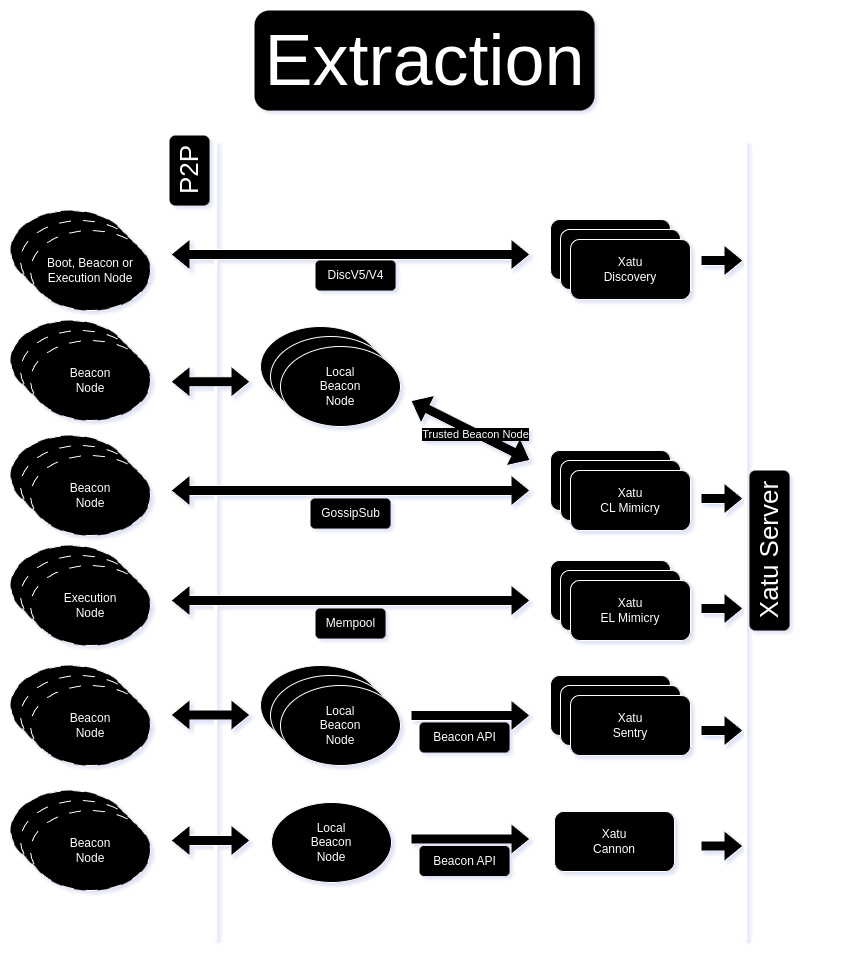

# Xatu data

This **dataset** contains a wealth of information about the **Ethereum network**, including detailed data on **beacon chain** events, **mempool** activity, and **canonical chain** events. Read more in our [announcement post](https://ethpandaops.io/posts/open-source-xatu-data/).

<p xmlns:cc="http://creativecommons.org/ns#" >This work is licensed under <a href="http://creativecommons.org/licenses/by/4.0/?ref=chooser-v1" target="_blank" rel="license noopener noreferrer" style="display:inline-block;">CC BY 4.0</a></p>



## Table of contents

- [Working with the data](#working-with-the-data)
  - [Setup clickhouse locally to import and query the data](#setup-clickhouse-locally-to-import-and-query-the-data)
  - [Jupyter Notebooks](#jupyter-notebooks)
- [Schema](#schema)
- [License](#license)
- [Maintainers](#maintainers)

## Working with the data

Data is stored in the [Apache Parquet](https://parquet.apache.org) format and can be consumed using a variety of tools. Here's some examples of how to query the data using [clickhouse client](https://clickhouse.com/docs/en/install):

```bash
# Query the first 10 rows of the beacon_api_eth_v1_events_block table for 2024-03-20
clickhouse client --query="$(<< 'EOF'

SELECT
  *
FROM
  url('https://data.ethpandaops.io/xatu/mainnet/databases/default/beacon_api_eth_v1_events_block/2024/3/20.parquet', 'Parquet')
LIMIT 10

EOF
)"
```

```bash
# Use globs to query multiple files eg. 15th to 20th March
clickhouse client --query="$(<< 'EOF'

SELECT
  *
FROM
  url('https://data.ethpandaops.io/xatu/mainnet/databases/default/beacon_api_eth_v1_events_block/2024/3/{15..20}.parquet', 'Parquet')
LIMIT 10

EOF
)"
```

### Setup clickhouse locally to import and query the data

You might want to download data from multiple tables and query the data. You can use our docker compose setup to run ClickHouse locally and have the schema migrations already applied for ease of use.

1. Run xatu [clickhouse docker compose](https://github.com/ethpandaops/xatu?tab=readme-ov-file#local-clickhouse) to stand up a local ClickHouse cluster with the xatu [migrations](https://github.com/ethpandaops/xatu/tree/master/deploy/migrations/clickhouse) automatically applied.
2. To import data you have 2 options:
  - Use the [import-clickhouse.sh](https://github.com/ethpandaops/xatu-data/blob/master/import-clickhouse.sh) script. 

```bash
./import-clickhouse.sh mainnet default beacon_api_eth_v1_events_block 2024-03-20

```

  - Import the data you want directly using the [`clickhouse client`](https://clickhouse.com/docs/en/interfaces/cli) CLI tool.

```bash
clickhouse client --query="$(<< 'EOF'

INSERT INTO
  default.beacon_api_eth_v1_events_block
SELECT *
  FROM url('https://data.ethpandaops.io/xatu/mainnet/databases/default/beacon_api_eth_v1_events_block/2024/3/{10..20}.parquet', 'Parquet');

EOF
)"
```

3. Query the data using the [`clickhouse client`](https://clickhouse.com/docs/en/interfaces/cli) CLI tool.

```bash
clickhouse client --query="$(<< 'EOF'

SELECT
  *
FROM
  default.beacon_api_eth_v1_events_block
LIMIT 10

EOF
)"
```

### Schema

For a detailed description of the data schema, please refer to the [Schema Documentation](https://ethpandaops.io/data/xatu/schema).

### Jupyter Notebooks

[Example notebook](./examples/jupyter-notebooks.ipynb)

## License

- Code: [MIT](./LICENSE)
- Data: [CC BY](https://creativecommons.org/licenses/by/4.0/deed.en)

## Maintainers

Sam - [@samcmau](https://twitter.com/samcmau)

Andrew - [@savid](https://twitter.com/Savid)
